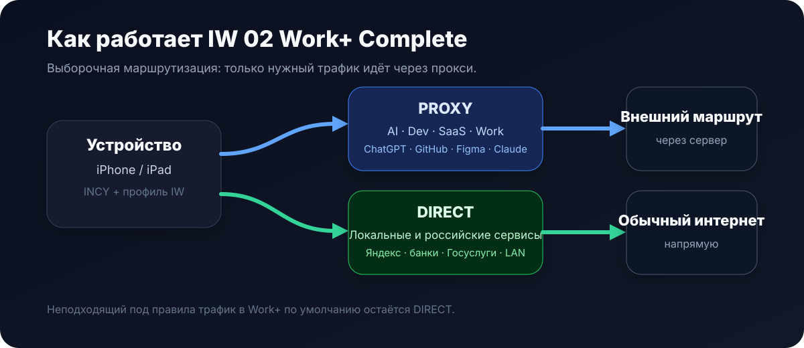
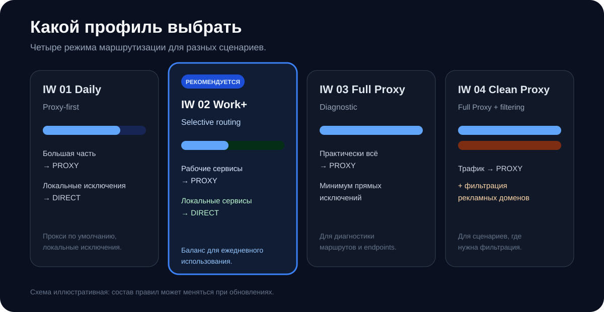

<p align="center">
  
</p>

<p align="center">
  <a href="README.md">Русский</a> · <a href="README_EN.md">English</a>
</p>

<p align="center">
  
  
  
</p>

**incy-wincy** — набор готовых профилей выборочной маршрутизации для **INCY**. Проект помогает разделять рабочий, локальный и системный трафик по разным маршрутам без необходимости вручную редактировать Xray-конфигурации.

> Проект независимый и не связан с разработчиками INCY, Xray или сервисами, упомянутыми в правилах.

## Быстрый старт

Для большинства сценариев рекомендуется **IW 02 Work+ Complete**.

<p align="center">
  
</p>

### Вариант 1 — QR

<p align="center">
  
</p>

QR содержит готовый INCY Autorouting deeplink.

### Вариант 2 — вставить ссылку вручную в INCY

В экран **«Импорт профиля» → «URL или Base64 профиля»** вставляйте именно эту полную ссылку:

```text
incy://autorouting/onadd/https://raw.githubusercontent.com/iGeezmo/incy-wincy/main/routing/IW_02_WorkPlus_Complete.json
```

Не вставляйте туда только `https://raw.githubusercontent.com/...json`: это адрес файла, а не полноценная INCY-команда импорта.

Если Autorouting не срабатывает, используйте одноразовый fallback:

```text
incy://routing/onadd/https://raw.githubusercontent.com/iGeezmo/incy-wincy/main/routing/IW_02_WorkPlus_Complete.json
```

После добавления полностью переподключите туннель.

Подробная инструкция: [docs/SETUP_RU.md](docs/SETUP_RU.md)

## Какой профиль выбрать

<p align="center">
  
</p>

| Профиль | Назначение | Маршрут по умолчанию |
|---|---|---|
| **IW 02 Work+ Complete** | **Рекомендуемый:** выборочная маршрутизация для повседневной работы | `DIRECT` |
| IW 01 Daily | Proxy-first профиль с прямыми исключениями | `PROXY` |
| IW 03 Full Proxy | Диагностический режим | `PROXY` |
| IW 04 Clean Proxy | Full Proxy + базовая фильтрация рекламных доменов | `PROXY` |
| **IW 05 Work+ Full Config Overlay** | Advanced: для provider full-config с собственными balancers/observatory | сохраняет provider fallback |

## Готовые INCY deeplink-ссылки

### IW 01 Daily

```text
incy://autorouting/onadd/https://raw.githubusercontent.com/iGeezmo/incy-wincy/main/routing/IW_01_Daily.json
```

### IW 02 Work+ Complete — рекомендуется

```text
incy://autorouting/onadd/https://raw.githubusercontent.com/iGeezmo/incy-wincy/main/routing/IW_02_WorkPlus_Complete.json
```

### IW 03 Full Proxy

```text
incy://autorouting/onadd/https://raw.githubusercontent.com/iGeezmo/incy-wincy/main/routing/IW_03_Full_Proxy.json
```

### IW 04 Clean Proxy

```text
incy://autorouting/onadd/https://raw.githubusercontent.com/iGeezmo/incy-wincy/main/routing/IW_04_Clean_Proxy.json
```

Все QR-коды: [docs/QR.md](docs/QR.md)

## IW 05 — для сложных provider Full Xray Config

Некоторые подписки передают INCY полный Xray-конфиг с собственными `outbounds`, `balancers`, `observatory` и routing-правилами. В таких конфигурациях обычный `IW 02` может контролировать не весь маршрут.

Для этого добавлен **IW 05 Work+ Full Config Overlay**. Он не заменяет provider config, а патчит экспортированный full Xray JSON и добавляет перед provider rules:

- DNS `UDP/53` → `DIRECT`;
- DNS/DoT `TCP/53,853` → `DIRECT`;
- NTP `UDP/123` → `DIRECT`;
- QUIC `UDP/443` → `BLOCK` для TCP/TLS fallback;
- DIRECT domains/IP из `IW 02` → `DIRECT`;
- затем сохраняет исходный provider routing/balancers.

Сборка:

```bash
python3 tools/patch_full_config.py provider.json -o IW_05_WorkPlus_FullConfig.json
```

Подробно: [docs/ADVANCED_FULL_CONFIG_RU.md](docs/ADVANCED_FULL_CONFIG_RU.md)

> Для IW 05 намеренно нет публичного универсального QR: готовый full config содержит реальные provider outbounds и credentials. Публиковать или подменять их общим статическим файлом небезопасно и технически неверно.

## Технический источник JSON

Если нужен именно URL файла профиля для интеграций/автообновления, основной JSON находится здесь:

```text
https://raw.githubusercontent.com/iGeezmo/incy-wincy/main/routing/IW_02_WorkPlus_Complete.json
```

Но для ручного импорта через экран INCY используйте deeplink выше.

## Что маршрутизирует Work+

Через **PROXY** направляются выбранные категории рабочих сервисов: AI/LLM, разработка, SaaS, collaboration, дизайн и отдельные media/social endpoints.

Через **DIRECT** направляются категории, для которых важен локальный маршрут: Яндекс, банки, госсервисы, российские маркетплейсы, карты/транспорт/доставка, операторы связи и локальные/private IP-сети.

Полный технический список находится в [`IW_02_WorkPlus_Complete.json`](routing/IW_02_WorkPlus_Complete.json).

## Почему выборочная маршрутизация

Широкое проксирование всего трафика может затронуть системные запросы iOS, авторизацию, CDN, push-сервисы и приложения, которым важен локальный IP-маршрут. Work+ минимизирует такие побочные эффекты и оставляет непопавший под правила трафик в `DIRECT`.

## Если приложение сообщает о VPN

`DIRECT` означает, что сетевой запрос приложения не отправляется через выбранный proxy-маршрут. При этом наличие активного VPN-интерфейса iOS может определяться приложением отдельно.

Для банковских и других security-sensitive приложений проект не использует MITM, hooks или модификацию приложений для обхода локальных проверок. Если DIRECT недостаточно, безопаснее временно отключить VPN.

Подробнее: [docs/TROUBLESHOOTING_RU.md](docs/TROUBLESHOOTING_RU.md)

## Структура проекта

```text
routing/     профили INCY и Autorouting deep links
advanced/    reference fragments для full Xray configs
tools/       локальные генераторы/патчеры full config
assets/      hero, схемы и QR-коды
docs/        установка, QR и диагностика
modules/     AdBlock / Privacy / исключения
```

## Issues и изменения правил

Если конкретный сервис работает неправильно, создайте Issue. Для мобильных приложений желательно приложить только домены/IP из INCY Tunnel Logs, относящиеся к проблеме. Не публикуйте cookies, токены, содержимое запросов и персональные данные.

## Назначение проекта

incy-wincy — инструмент управления сетевой маршрутизацией и совместимостью приложений. Проект не предназначен для обхода установленных законом ограничений, антифрод-механизмов, систем лицензирования или контроля доступа.

## Лицензия

Собственные материалы incy-wincy распространяются по **Apache License 2.0**. См. [LICENSE](LICENSE) и [NOTICE](NOTICE).
